# PocketFlow FastAPI WebSocket Chat

Real-time chat interface with streaming LLM responses using PocketFlow, FastAPI, and WebSocket.

<p align="center">
  
</p>
## How It Works

The magic happens through a two-phase pipeline implemented with PocketFlow:

```mermaid
flowchart TD
    %% 左侧列 - 文档处理流程
    subgraph LeftColumn [文档处理流程]
        direction TB
        A1[📄 文档导入] --> A2[文档加载与解析]
        A2 --> A3[文本分割<br>Text Splitting]
        A3 --> A4[文本向量化<br>Embedding]
        A4 --> A5[向量存储]
    end

    %% 中间列 - 向量数据库
    subgraph MiddleColumn [向量数据库]
        direction TB
        DB[(向量数据库<br>Vector Store)]
    end
    
    %% 右侧列 - 查询与响应流程
    subgraph RightColumn [查询与响应流程]
        direction TB
        B1[❓ 用户输入查询] --> B2[查询预处理]
        B2 --> B3[查询向量化<br>Query Embedding]
        B3 --> B4[相似性检索<br>Similarity Search]
        B4 --> C1[重排序<br>Re-ranking]
        C1 --> C2[选择最相关片段]
        C2 --> D1[组合查询与上下文]
        D1 --> D2[LLM生成回答<br>Large Language Model]
        D2 --> D3[✅ 返回最终答案]
    end
    
    %% 连接左侧和中间列
    A5 --> DB
    
    %% 连接中间列和右侧列
    DB --> B4
    
    %% 样式定义
    classDef docProcess fill:#E3F2FD,stroke:#0D47A1,stroke-width:2px,color:#0D47A1;
    classDef vectorDB fill:#FFEBEE,stroke:#C62828,stroke-width:2px,color:#C62828;
    classDef queryProcess fill:#E8F5E9,stroke:#2E7D32,stroke-width:2px,color:#2E7D32;
    classDef rerankProcess fill:#FFF8E1,stroke:#FF8F00,stroke-width:2px,color:#FF8F00;
    classDef responseProcess fill:#F3E5F5,stroke:#4A148C,stroke-width:2px,color:#4A148C;
    
    %% 应用样式
    class A1,A2,A3,A4,A5 docProcess;
    class DB vectorDB;
    class B1,B2,B3,B4 queryProcess;
    class C1,C2 rerankProcess;
    class D1,D2,D3 responseProcess;
```


## Features

- **Real-time Streaming**: See AI responses typed out in real-time as the LLM generates them
- **Conversation Memory**: Maintains chat history across messages
- **Modern UI**: Clean, responsive chat interface with gradient design
- **WebSocket Connection**: Persistent connection for instant communication
- **PocketFlow Integration**: Uses PocketFlow `AsyncNode` and `AsyncFlow` for streaming

## How to Run

1. **Set OpenAI API Key:**
   ```bash
   export OPENAI_API_KEY="your-openai-api-key"
   ```

2. **Install Dependencies:**
   ```bash
   pip install -r requirements.txt
   ```

3. **Run the Application:**
   ```bash
   python main.py
   ```

4. **Access the Web UI:**
   Open `http://localhost:8000` in your browser.

## Usage

1. **Type Message**: Enter your message in the input field
2. **Send**: Press Enter or click Send button
3. **Watch Streaming**: See the AI response appear in real-time
4. **Continue Chat**: Conversation history is maintained automatically

## Files

- [`main.py`](./main.py): FastAPI application with WebSocket endpoint
- [`nodes.py`](./nodes.py): PocketFlow `StreamingChatNode` definition
- [`flow.py`](./flow.py): PocketFlow `AsyncFlow` for chat processing
- [`utils/stream_llm.py`](./utils/stream_llm.py): OpenAI streaming utility
- [`static/index.html`](./static/index.html): Modern chat interface
- [`requirements.txt`](./requirements.txt): Project dependencies
- [`docs/design.md`](./docs/design.md): System design documentation
- [`README.md`](./README.md): This file 